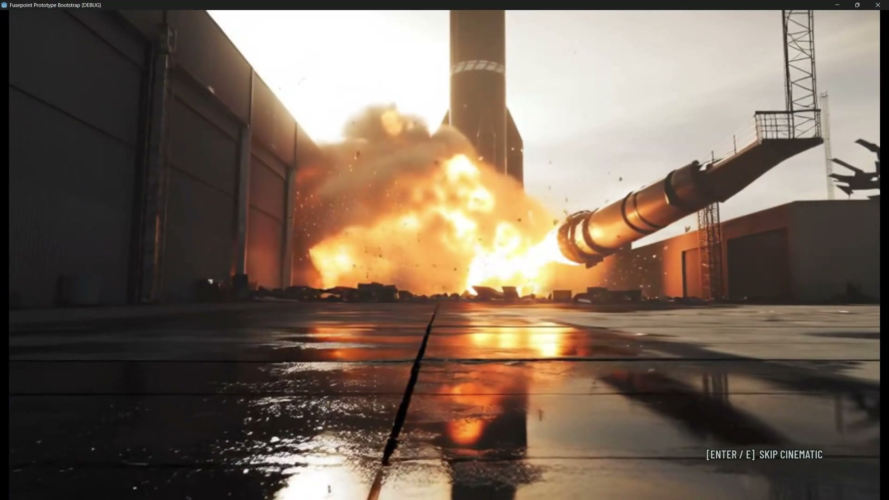

<p align="center">
  
</p>

<h1 align="center">Harness of Harness</h1>

<p align="center"><em>Multi-Day Autonomous Software Development with Continual Improvement</em></p>

<p align="center">
  <a href="https://flesymeb.github.io/HarnessOfHarness/"></a>
  <a href="assets/paper/harness-of-harness.pdf"></a>
  <a href="#repository-status"></a>
</p>

<p align="center">
  
</p>

<p align="center"><strong>From specification to a playable FPS — developed through continual autonomous loops.</strong></p>

## Overview

> This paper studies autonomous software development, in which LLM-based coding agents transform high-level requirements into complete, functional, and usable software systems without human intervention.

In this setting, “given only high-level requirements as human input, coding agents start from scratch and independently transform the requirements into complete, functional, and deployable software systems, without further human guidance or intervention.”

> Here, we introduce Harness-of-Harness (HoH), a framework that equips coding agents with *continual improvement* capabilities for autonomous software development.

HoH builds upon existing coding-agent harnesses and organizes development into iterative planning–coding–testing loops. Persistent artifacts, execution evidence, and versioned project histories allow an agent to sustain coherent progress across many loops instead of restarting from isolated episodes. The project is evaluated on three software benchmarks and through **Fusepoint**, a single-player FPS developed from an initial product requirements document.

## Highlights

- Continual planning, implementation, testing, and evidence-grounded refinement
- Persistent project state for multi-day autonomous development
- A complete game-development case study from an initial specification to a playable FPS
- Evaluation across GameCraft-Bench, FrontierSWE, and ProgramBench

## Project Materials

- **[Project page](https://flesymeb.github.io/HarnessOfHarness/)** — paper overview, results, videos, and the Fusepoint case study
- **[Paper](assets/paper/harness-of-harness.pdf)** — *Harness of Harness: Multi-Day Autonomous Software Development with Continual Improvement*
- **[Supplementary material](assets/paper/supplementary.pdf)**
- **Playable builds** — coming soon

## Repository Status

The `main` branch currently contains the project presentation and research materials. The HoH implementation is not included yet.

**Code coming soon.**

## Citation

† Haoyang Yan, Min-Le Su, Hangfan Zhang, and Zhanhao Li contributed equally.

```bibtex
@article{yan2026harness,
  title={Harness of Harness: Multi-Day Autonomous Software Development with Continual Improvement},
  author={Yan, Haoyang and Su, Min-Le and Zhang, Hangfan and Li, Zhanhao and Zhang, Chen and Zhang, Shao and Chen, Yang and Bai, Lei and Hu, Shuyue},
  journal={arXiv preprint},
  year={2026}
}
```
