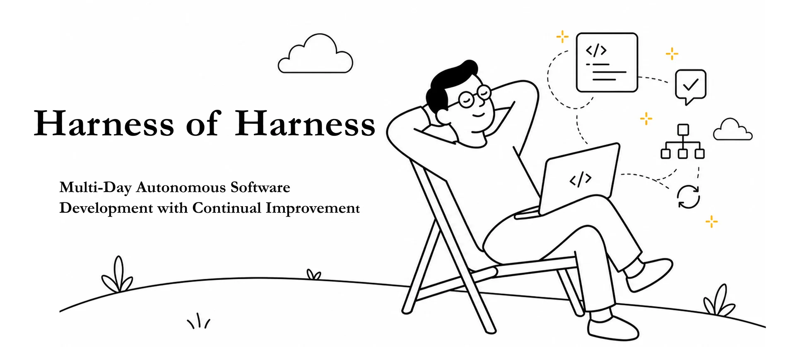
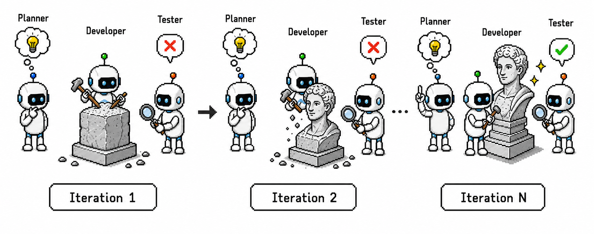

<div align="center">
  
</div>

<hr>

<p align="center"><strong><big><big>Harness of Harness</big></big></strong></p>

<p align="center"><em>Multi-Day Autonomous Software Development with Continual Improvement</em></p>

<p align="center">
  <a href="https://flesymeb.github.io/HarnessOfHarness/#resources"></a>
  <a href="https://github.com/Flesymeb/HarnessOfHarness"></a>
  <a href="https://flesymeb.github.io/HarnessOfHarness/"></a>
  <a href="https://flesymeb.github.io/HarnessOfHarness/#resources"></a>
</p>

## 🗞️ News

- 🎉 **Coming soon** — We will publicly release **HoH-lite**, a lightweight implementation of HoH's core workflow.
- 🎉 **2026-09** — Added the Harness of Harness project page and the Fusepoint gameplay showcase.
- 🎉 **2026-08** — Fusepoint reached more than 60 autonomous development loops.

## Overview

Harness of Harness (HoH) extends coding-agent harnesses with a persistent,
evidence-grounded development loop. Instead of treating every invocation as an
isolated coding task, HoH carries the evolving software artifact, execution
evidence, and next-step decisions across iterations.

Our paper studies autonomous software development from scratch and evaluates
the approach on three software-engineering benchmarks. **Fusepoint** provides
an open-ended case study: a single-player FPS developed over more than 60
autonomous loops.

## How It Works

Each iteration uses the same evolving project workspace and coordinates three
stable roles:

- **Project Planner** — reads the public requirements and evidence from the
  previous iteration, then writes a prioritized development document. It does
  not modify the artifact.
- **Developer** — implements the current development document in the shared
  workspace while preserving functionality that has already been verified.
- **QA Tester** — executes and inspects the updated artifact against the
  requirements, recording evidence for verified behavior and unresolved gaps.
  It remains read-only.

<p align="center">
  
</p>

The resulting artifact and evidence bundle become the starting state for the
next iteration, allowing the system to improve loop by loop.

## Demos

| Game | Genre | Showcase | Download | GitHub |
|:--|:--|:--:|:--:|:--:|
| **Fusepoint** | FPS | [](https://flesymeb.github.io/HarnessOfHarness/#demo) | [](https://flesymeb.github.io/HarnessOfHarness/#resources) | [](https://github.com/Flesymeb/fusepoint) |
| **Mournlight** | TBD |  | [](https://github.com/Flesymeb/mournlight/releases) | [](https://github.com/Flesymeb/mournlight) |

## Code

We will publicly release HoH-lite, a lightweight implementation of HoH's core workflow.

## Citation

```bibtex
@article{yan2026harness,
  title={Harness of Harness: Multi-Day Autonomous Software Development with Continual Improvement},
  author={Yan, Haoyang and Su, Minle and Zhang, Hangfan and Li, Zhanhao and Zhang, Chen and Zhang, Shao and Chen, Yang and Bai, Lei and Hu, Shuyue},
  journal={arXiv preprint},
  year={2026}
}
```

## License

Original materials in this repository are released under the [MIT License](LICENSE).

## Contributors

We thank everyone who contributed to Harness of Harness and its case studies.

| Contributor | GitHub |
|:--|:--:|
| Hyoung Yan | [@Flesymeb](https://github.com/Flesymeb) |
| Ray Burstray | [@rayburstray](https://github.com/rayburstray) |
| HaoTechGuy | [@HaoTechGuy](https://github.com/HaoTechGuy) |
| qzzqzzb | [@qzzqzzb](https://github.com/qzzqzzb) |
