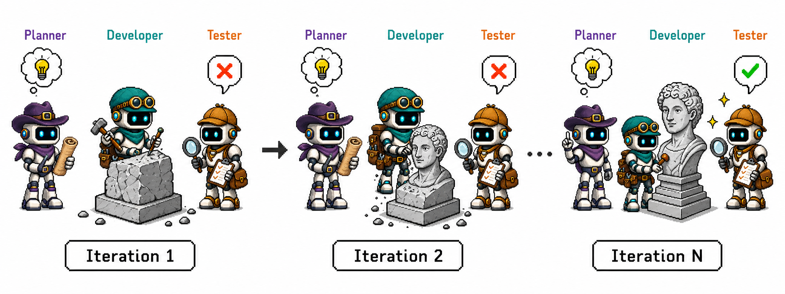

<p align="center">
  
</p>

<h1 align="center">Harness of Harness</h1>

<p align="center"><em>Multi-Day Autonomous Software Development with Continual Improvement</em></p>

<p align="center">
  <a href="https://flesymeb.github.io/HarnessOfHarness/#resources"></a>
  <a href="https://github.com/Flesymeb/HarnessOfHarness"></a>
  <a href="https://flesymeb.github.io/HarnessOfHarness/"></a>
  <a href="https://flesymeb.github.io/HarnessOfHarness/#resources"></a>
</p>

<p align="center">
  
</p>

<p align="center"><strong>From specification to a playable FPS — developed through continual autonomous loops.</strong></p>

## Overview

Harness of Harness (HoH) turns coding-agent harnesses into a continual development process. Persistent artifacts, execution evidence, and explicit next-step decisions allow an agent to improve a software system across many days instead of restarting from isolated episodes.

The project is presented through a research paper, benchmark results, and **Fusepoint**, a single-player FPS developed through repeated autonomous development loops.

## Highlights

- Continual planning, implementation, testing, and evidence-grounded refinement
- Persistent project state for multi-day autonomous development
- A complete game-development case study from an initial specification to a playable FPS
- Evaluation across GameCraft-Bench, FrontierSWE, and ProgramBench

## Project Materials

- **[Project page](https://flesymeb.github.io/HarnessOfHarness/)** — paper overview, results, videos, and the Fusepoint case study
- **Paper** — *Harness of Harness: Multi-Day Autonomous Software Development with Continual Improvement* (available on the [project page](https://flesymeb.github.io/HarnessOfHarness/#resources))
- **Supplementary material** — available on the [project page](https://flesymeb.github.io/HarnessOfHarness/#resources)
- **Playable builds** — coming soon

## Repository Status

The `main` branch currently contains the project presentation and research materials. The HoH implementation is not included yet.

**Code coming soon.**

## Citation

```bibtex
@article{yan2026harness,
  title={Harness of Harness: Multi-Day Autonomous Software Development with Continual Improvement},
  author={Yan, Haoyang and Su, Minle and Zhang, Hangfan and Li, Zhanhao and Zhang, Chen and Zhang, Shao and Chen, Yang and Bai, Lei and Hu, Shuyue},
  journal={arXiv preprint},
  year={2026}
}
```
